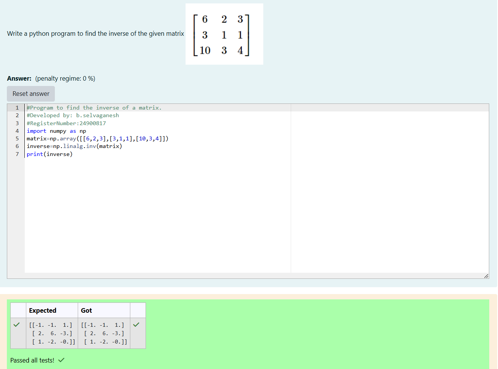

# INVERSE-OF-A-MATRIX
## Aim:
To write a python program to find the inverse of a matrix
## Equipment’s required:
1. 	Hardware – PCs
2. 	Anaconda – Python 3.7 Installation / Moodle-Code Runner
## Algorithm:
### Step1 : import numpy as np from library
### Step 2: define a square matrix using numpy function
### Step 3:use the function np.linalg.inv(matrix) to calucalte the inverse of the matrix 
### Step 4: print the inverse matrix

## Program:
```
#Program to find the inverse of a matrix.
#Developed by: b.selvaganesh
#RegisterNumber:24900817
import numpy as np
matrix=np.array([[6,2,3],[3,1,1],[10,3,4]])
inverse=np.linalg.inv(matrix)
print(inverse)
```
## Output:

## Result:
Thus the inverse of given matrix is successfully solved using python program

